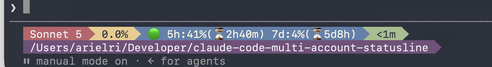

# claude-code-multi-account-statusline

Installs and configures [ccstatusline](https://github.com/sirmalloc/ccstatusline) for
[Claude Code](https://claude.com/product/claude-code), with a custom widget that shows
usage limits directly in the statusline — plus per-account shell aliases so you can run
several Claude Code accounts side by side (`claude-work`, `claude-personal`, etc.),
each with its own credentials and config.

Works over SSH, no browser required. macOS, Linux, and native Windows are all supported.



## What it does

- Installs Node.js if missing, resolves the real `claude` binary path.
- On macOS, installs a Nerd Font (Hack Nerd Font) if none is present — needed
  for the statusline's powerline separators to render correctly instead of as
  boxes with a "?". Not needed on Linux/Windows, whose terminals already
  cover the glyph.
- Lets you configure N accounts, each backed by its own `CLAUDE_CONFIG_DIR`
  (`~/.claude-<name>`), and adds a `claude-<name>` alias/function for each.
- Installs [ccstatusline](https://www.npmjs.com/package/ccstatusline) with a minimalist
  layout: model, context usage, a usage widget, session clock, and cwd.
- The usage widget shows:
  - **Pro/Max-style accounts**: `five_hour` / `seven_day` rate-limit windows, with time
    left until each resets.
  - **Enterprise-style accounts** (no rate-limit windows, dollar spend cap instead):
    `$used/$limit (%)`, with time left until the monthly reset.
- Re-running the installer offers repair (idempotent, no duplicate aliases), full
  reconfigure, or uninstall.

## Install

Runs straight from the network, nothing saved to disk.

### macOS / Linux

```bash
bash <(curl -fsSL https://raw.githubusercontent.com/ArielRi/claude-code-multi-account-statusline/main/ccstatusline-install.sh)
```

`curl ... | bash` also runs it, but process substitution (`bash <(...)`) is used
instead because a plain pipe hands the script's own stdin to `bash`, breaking the
`read` prompts — `<(...)` keeps your terminal attached so the prompts still work.

### Windows (PowerShell 5.1 or 7+)

```powershell
iex (irm https://raw.githubusercontent.com/ArielRi/claude-code-multi-account-statusline/main/ccstatusline-install.ps1)
```

If script execution is blocked, run once: `Set-ExecutionPolicy -Scope CurrentUser RemoteSigned`

### Prefer to review the script first?

```bash
curl -fsSL https://raw.githubusercontent.com/ArielRi/claude-code-multi-account-statusline/main/ccstatusline-install.sh -o ccstatusline-install.sh
less ccstatusline-install.sh && bash ccstatusline-install.sh
```

```powershell
irm https://raw.githubusercontent.com/ArielRi/claude-code-multi-account-statusline/main/ccstatusline-install.ps1 -OutFile ccstatusline-install.ps1
notepad ccstatusline-install.ps1; .\ccstatusline-install.ps1
```

## Uninstall

Passing `--uninstall`/`-Uninstall` needs a local copy of the script (see above to
fetch one) — a bare `iex`/process-substitution one-liner has nothing to attach the
flag to:

```bash
bash ccstatusline-install.sh --uninstall
```

```powershell
.\ccstatusline-install.ps1 -Uninstall
```

Removes the ccstatusline config, the `statusLine` entry from each account's
`settings.json`, and the generated aliases. Account directories (`~/.claude-*`,
which hold your login credentials) are left untouched.

## Notes

- On macOS, per-account credentials are looked up directly in Keychain by the
  service Claude Code derives from each `CLAUDE_CONFIG_DIR` — no manual email
  matching needed.
- On Windows, aliases are written to both the Windows PowerShell 5.1 and
  PowerShell 7+ profile files, since most machines have both installed and
  either one might be what you open next.
- If the installer installed a Nerd Font on your Mac, set it as your
  terminal's font (Terminal.app: Settings > Profiles > Text; iTerm2:
  Settings > Profiles > Text) — installing the font file doesn't switch your
  terminal to use it automatically.
